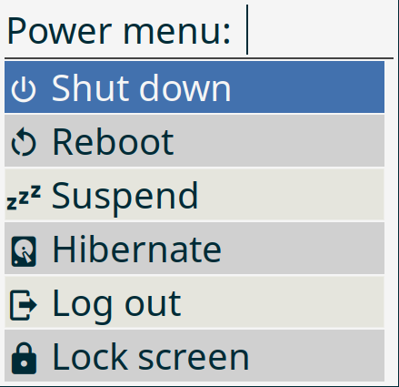

# Rofi Power Menu Mode


Rofi Power Menu provides a mode for offering basic power menu operations such as
shutting down, logging out, rebooting and suspending. By default, it shows all
choices and asks for confirmation for irreversible actions. The choices, their
order and whether they require confirmation, can be all configured with
command-line options. It also shows icons if you pass `-show-icons` to rofi and
have some normal icon set properly installed.

In contrast to other similar solutions I've found, the power menu is implemented
as a rofi mode, not as a stand-alone executable that launches rofi by itself.
This makes it possible to combine the script with the full power of how rofi can
use modi. For instance, you can have multiple modi available (`-modi`) or
combine multiple modi in one mode (`-combi-modi`), pass your own themes
(`-theme`) and configurations as CLI flags (e.g., `-show-icons`, `-fullscreen`,
`-sidebar-mode`, `-matching fuzzy`, `-location`).

There's also a stand-alone script which uses dmenu (or rofi in dmenu mode). It's
also a bit easier to use as you don't need to type the small amount of rofi
"boilerplate".

Just to give an example, the screenshot below shows Rofi Power Menu launched as:

```
rofi -show p -modi p:rofi-power-menu \
  -show-icons \
  -icon-theme Adwaita \
  -theme Paper \
  -font "JetBrains Mono 16" \
  -width 20 \
  -lines 6
```




## Install

You can use the script directly from this directory without needing to install
it at all. If you want rofi to find it more easily, the script needs to be found
in `PATH`. If you have `~/.local/bin` in `PATH`, you can just copy the script
there:

```
cp rofi-power-menu ~/.local/bin/
```


## Usage

A simple example showing how to launch the power menu:

```
rofi -show power-menu -modi power-menu:rofi-power-menu
```

If you didn't install the script in `PATH`, you need to give the path to the
script. If you're running rofi under this directory where the script is, you can
run it as follows:

```
rofi -show power-menu -modi power-menu:./rofi-power-menu
```


### `--help`

```
rofi-power-menu - a power menu mode for Rofi

Usage: rofi-power-menu [--choices CHOICES] [--confirm CHOICES]
                       [--choose CHOICE] [--dry-run]

Use with Rofi in script mode. For instance, to ask for shutdown or reboot:

  rofi -show menu -modi "menu:rofi-power-menu --choices=shutdown/reboot"

Available options:
  --dry-run          Don't perform the selected action but print it to stderr.
  --choices CHOICES  Show only the selected choices in the given order. Use /
                     as the separator. Available choices are lockscreen, logout,
                     suspend, hibernate, reboot and shutdown. By default, all
                     available choices are shown.
  --confirm CHOICES  Require confirmation for the gives choices only. Use / as
                     the separator. Available choices are lockscreen, logout,
                     suspend, hibernate, reboot and shutdown. By default, only
                     irreversible actions logout, reboot and shutdown require
                     confirmation.
  --choose CHOICE    Preselect the given choice and only ask for a confirmation
                     (if confirmation is set to be requested). It is strongly
                     recommended to combine this option with --confirm=CHOICE
                     if the choice wouldn't require confirmation by default.
                     Available choices are lockscreen, logout, suspend,
                     hibernate, reboot and shutdown.
  -h,--help          Show this help text.
```


### `--choices=CHOICE1/CHOICE2/...`

By default, the menu shows all available choices in a particular order. You can
control the shown choices and their order by using `--choices` and listing the
desired choices with `/` as the separator. Available choices are:

- `lockscreen`: Lock screen
- `logout`: Log out (confirmation asked by default)
- `suspend`: Suspend
- `hibernate`: Hibernate
- `reboot`: Reboot (confirmation asked by default)
- `shutdown`: Shutdown (confirmation asked by default)

For instance, to show only `shutdown` and `reboot` choices:

```
rofi -show power-menu -modi "power-menu:./rofi-power-menu --choices=shutdown/reboot"
```

Or if you want a typical session menu:

```
rofi -show session-menu -modi "session-menu:./rofi-power-menu --choices=logout/lockscreen"
```

### `--confirm=CHOICE1/CHOICE2/...`

By default, confirmation is asked for irreversible actions `logout`, `reboot`
and `shutdown`. You can choose for which actions you want confirmation (if any)
by listing them with `--confirm` option. For instance, confirmation can be asked
only for `reboot` and `shutdown`:


```
rofi -show power-menu -modi "power-menu:./rofi-power-menu --confirm=reboot/shutdown"
```

If you don't want confirmations for any actions, just give an empty string:

```
rofi -show power-menu -modi "power-menu:./rofi-power-menu --confirm=''"
```


### `--choose=CHOICE`

To open just a confirmation dialog for some fixed choice, you can use
`--choose=CHOICE`, where `CHOICE` can again be one of the choices listed above.
You should also require confirmation for that choice if that isn't done by
default. For instance, a simple logout confirmation:

```
rofi -show logout -modi "logout:./rofi-power-menu --choose=logout"
```

For some choices (e.g., `hibernate`), confirmation isn't asked by default, so
you probably want to ask that in this case:

```
rofi -show hibernate -modi "hibernate:./rofi-power-menu --choose=hibernate --confirm=hibernate"
```

If confirmation isn't asked, the action is performed immediately. Although,
that's probably not useful, it is possible. However, note that Rofi will still
pop up a menu with no options available. It would be nice if Rofi would not
appear at all if it wasn't given any choices. This works when running the
accompanied stand-alone script `dmenu-power-menu`.


### `--dry-run`

For debugging and development purposes, you can pass `--dry-run` flag. Then, the
selected action isn't performed but only printed to stderr.


### dmenu

There's a stand-alone script `dmenu-power-menu` that can be used to run the
power menu with dmenu (or rofi in dmenu mode if dmenu isn't found). That script
takes the same command-line arguments as listed above for the main script
`rofi-power-menu`. The stand-alone script might be easier to use but you cannot
pass arguments to dmenu/rofi so their configuration is hardcoded.


## Copyright

Copyright (c) 2020 Jaakko Luttinen

MIT License
